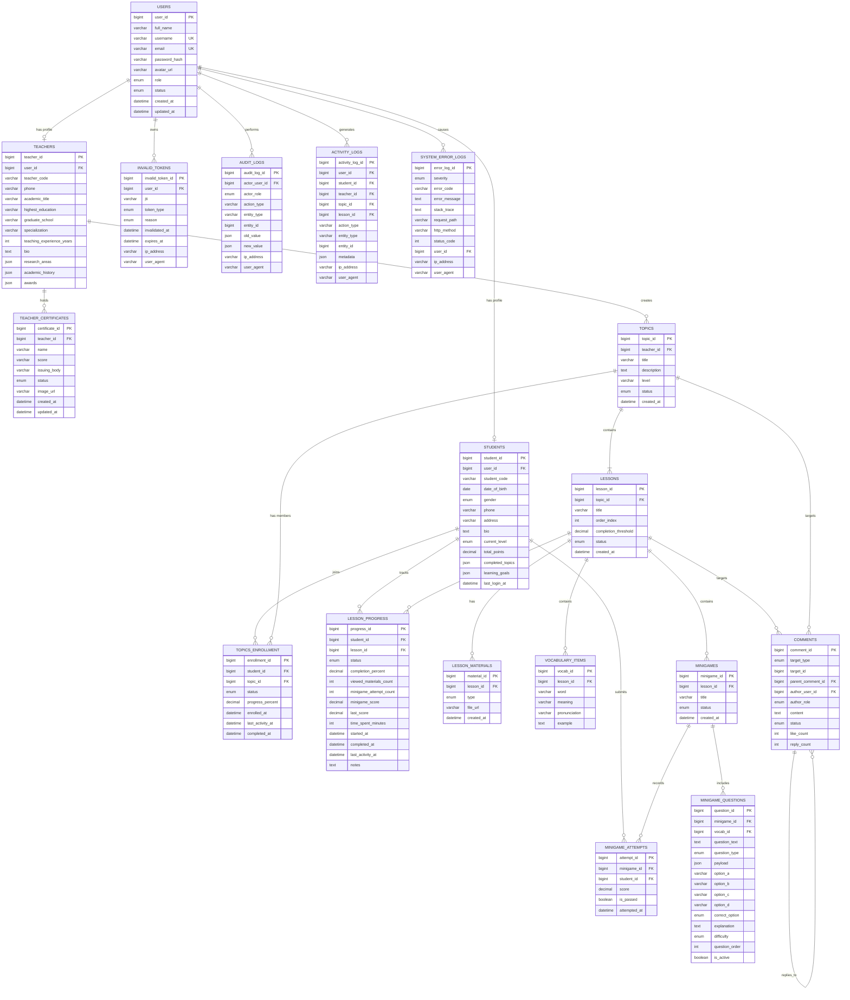

# TÀI LIỆU THIẾT KẾ CƠ SỞ DỮ LIỆU (DATABASE DESIGN SPECIFICATION)

## Nền tảng Học tiếng Anh Trực tuyến Đa nền tảng (Web & Mobile App)

**Kiến trúc:** MySQL-only relational database (không dùng MongoDB)  
**Phiên bản:** 2.2  
**Ngày cập nhật:** 01/09/2026

---

## 1. TỔNG QUAN KIẾN TRÚC LƯU TRỮ (MYSQL-ONLY ARCHITECTURE)

Hệ thống áp dụng mô hình lưu trữ **MySQL thuần** để đảm bảo tính nhất quán dữ liệu, dễ kiểm soát ràng buộc quan hệ và dễ mở rộng theo nghiệp vụ học tập, phân quyền, tiến độ, minigame, bình luận và log hệ thống.

1. **Relational Database (MySQL - 18 bảng chính):**
   - Đảm nhiệm toàn bộ nghiệp vụ cốt lõi: người dùng, student profile, teacher profile, quyền hạn, chủ đề, bài học, tài liệu, từ vựng, minigame, tiến độ, logs và bình luận.
   - Các dữ liệu linh hoạt như hồ sơ học thuật, danh sách topic đã học, metadata hoạt động được lưu dưới dạng `JSON` trong MySQL để giữ tính mềm dẻo nhưng vẫn nằm trong cùng một hệ quản trị.

2. **Không còn MongoDB trong kiến trúc hiện tại:**
   - `minigame_questions` được lưu trong bảng SQL chuẩn theo cấu trúc bảng `minigame_questions`.
   - `comments` được lưu trong bảng SQL chuẩn `comments` với khả năng reply lồng nhau bằng `parent_comment_id`.
   - `audit_logs`, `activity_logs`, `system_error_logs` được lưu trong các bảng SQL riêng để dễ truy vấn, lọc và báo cáo.

3. **Nguyên tắc thiết kế dữ liệu:**
   - Mọi quan hệ business-critical đều là FK trong MySQL.
   - Mọi dữ liệu có tính không cố định hoặc dạng JSON như học thuật, lịch sử hoạt động được lưu là `JSON`.
   - Không phát sinh phụ thuộc vào NoSQL trong hệ thống này.

---

## 2. MÔ HÌNH QUAN HỆ CƠ SỞ DỮ LIỆU (RELATIONSHIP MODEL & ERD)

### 2.1. Sơ đồ Quan hệ Thực thể Toàn diện (Full ERD Diagram)



---

### 2.2. Bảng Ma trận Quan hệ Chi tiết (Relationship Matrix)

| Bảng nguồn (Parent / Source) | Bảng đích (Child / Target) | Loại quan hệ | Khóa ngoại (Foreign Key)                                   | Quy tắc toàn vẹn (Cascade Rule) | Mô tả nghiệp vụ                                        |
| ---------------------------- | -------------------------- | :----------: | ---------------------------------------------------------- | ------------------------------- | ------------------------------------------------------ |
| `USERS`                      | `STUDENTS`                 |  **1 – 1**   | `STUDENTS.user_id` → `USERS.user_id`                       | `ON DELETE CASCADE`             | Mỗi người dùng học sinh có hồ sơ cá nhân riêng.        |
| `USERS`                      | `TEACHERS`                 |  **1 – 1**   | `TEACHERS.user_id` → `USERS.user_id`                       | `ON DELETE CASCADE`             | Mỗi người dùng giáo viên có hồ sơ chuyên môn riêng.    |
| `TEACHERS`                   | `TEACHER_CERTIFICATES`     |  **1 – N**   | `TEACHER_CERTIFICATES.teacher_id` → `TEACHERS.teacher_id`  | `ON DELETE CASCADE`             | Mỗi giáo viên có nhiều chứng chỉ giảng dạy.            |
| `TEACHERS`                   | `TOPICS`                   |  **1 – N**   | `TOPICS.teacher_id` → `TEACHERS.teacher_id`                | `ON DELETE RESTRICT`            | Một giáo viên quản lý nhiều chủ đề.                    |
| `STUDENTS`                   | `TOPICS_ENROLLMENT`        |  **1 – N**   | `TOPICS_ENROLLMENT.student_id` → `STUDENTS.student_id`     | `ON DELETE CASCADE`             | Học sinh tham gia nhiều topic.                         |
| `TOPICS`                     | `TOPICS_ENROLLMENT`        |  **1 – N**   | `TOPICS_ENROLLMENT.topic_id` → `TOPICS.topic_id`           | `ON DELETE CASCADE`             | Topic có nhiều học sinh đăng ký.                       |
| `TOPICS`                     | `LESSONS`                  |  **1 – N**   | `LESSONS.topic_id` → `TOPICS.topic_id`                     | `ON DELETE CASCADE`             | Một chủ đề có nhiều bài học.                           |
| `LESSONS`                    | `LESSON_MATERIALS`         |  **1 – N**   | `LESSON_MATERIALS.lesson_id` → `LESSONS.lesson_id`         | `ON DELETE CASCADE`             | Một bài học có nhiều tài liệu.                         |
| `LESSONS`                    | `VOCABULARY_ITEMS`         |  **1 – N**   | `VOCABULARY_ITEMS.lesson_id` → `LESSONS.lesson_id`         | `ON DELETE CASCADE`             | Một bài học chứa nhiều từ vựng.                        |
| `LESSONS`                    | `MINIGAMES`                |  **1 – N**   | `MINIGAMES.lesson_id` → `LESSONS.lesson_id`                | `ON DELETE CASCADE`             | Mỗi bài học có thể có nhiều minigame.                  |
| `MINIGAMES`                  | `MINIGAME_QUESTIONS`       |  **1 – N**   | `MINIGAME_QUESTIONS.minigame_id` → `MINIGAMES.minigame_id` | `ON DELETE CASCADE`             | Một minigame có nhiều câu hỏi.                         |
| `MINIGAMES`                  | `MINIGAME_ATTEMPTS`        |  **1 – N**   | `MINIGAME_ATTEMPTS.minigame_id` → `MINIGAMES.minigame_id`  | `ON DELETE CASCADE`             | Một minigame có nhiều lượt làm bài.                    |
| `STUDENTS`                   | `MINIGAME_ATTEMPTS`        |  **1 – N**   | `MINIGAME_ATTEMPTS.student_id` → `STUDENTS.student_id`     | `ON DELETE CASCADE`             | Học sinh có nhiều lượt làm bài.                        |
| `STUDENTS`                   | `LESSON_PROGRESS`          |  **1 – N**   | `LESSON_PROGRESS.student_id` → `STUDENTS.student_id`       | `ON DELETE CASCADE`             | Học sinh theo dõi tiến độ mỗi bài học.                 |
| `LESSONS`                    | `LESSON_PROGRESS`          |  **1 – N**   | `LESSON_PROGRESS.lesson_id` → `LESSONS.lesson_id`          | `ON DELETE CASCADE`             | Một bài học theo dõi tiến độ của nhiều học sinh.       |
| `COMMENTS`                   | `COMMENTS`                 |  **1 – N**   | `COMMENTS.parent_comment_id` → `COMMENTS.comment_id`       | `ON DELETE CASCADE`             | Hỗ trợ cây phản hồi (reply thread).                    |
| `USERS`                      | `INVALID_TOKENS`           |  **1 – N**   | `INVALID_TOKENS.user_id` → `USERS.user_id`                 | `ON DELETE CASCADE`             | Mỗi user có nhiều token đã bị vô hiệu hóa (blacklist). |
| `USERS`                      | `AUDIT_LOGS`               |  **1 – N**   | `AUDIT_LOGS.actor_user_id` → `USERS.user_id`               | `ON DELETE SET NULL`            | Lưu lịch sử thao tác quản trị.                         |
| `USERS`                      | `ACTIVITY_LOGS`            |  **1 – N**   | `ACTIVITY_LOGS.user_id` → `USERS.user_id`                  | `ON DELETE SET NULL`            | Lưu hoạt động người dùng.                              |
| `USERS`                      | `SYSTEM_ERROR_LOGS`        |  **1 – N**   | `SYSTEM_ERROR_LOGS.user_id` → `USERS.user_id`              | `ON DELETE SET NULL`            | Ghi lỗi hệ thống liên quan user.                       |

---

## 3. THIẾT KẾ CHI TIẾT CSDL QUAN HỆ (RDBMS - 18 BẢNG CHÍNH)

### 3.1. Chi tiết Đặc tả 18 Bảng SQL

#### 1. Bảng `USERS` (Tài khoản & Phân quyền)

| Tên trường      | Kiểu dữ liệu                       |  Khóa  | Ràng buộc                                             | Mô tả                  |
| --------------- | ---------------------------------- | :----: | ----------------------------------------------------- | ---------------------- |
| `user_id`       | BIGINT                             | **PK** | AUTO_INCREMENT                                        | Khóa chính người dùng  |
| `full_name`     | VARCHAR(255)                       |        | NOT NULL                                              | Họ và tên              |
| `username`      | VARCHAR(50)                        | **UQ** | NOT NULL                                              | Tên đăng nhập duy nhất |
| `email`         | VARCHAR(255)                       | **UQ** | NOT NULL                                              | Email đăng nhập        |
| `password_hash` | VARCHAR(255)                       |        | NOT NULL                                              | Mật khẩu đã băm        |
| `avatar_url`    | VARCHAR(500)                       |        | NULL                                                  | Ảnh đại diện           |
| `role`          | ENUM('STUDENT','TEACHER','ADMIN')  |        | NOT NULL DEFAULT 'STUDENT'                            | Vai trò                |
| `status`        | ENUM('PENDING','ACTIVE','LOCKED','INACTIVE') |        | NOT NULL DEFAULT 'PENDING'                            | Trạng thái (PENDING→ACTIVE sau khi xác thực email) |
| `created_at`    | DATETIME                           |        | DEFAULT CURRENT_TIMESTAMP                             | Thời điểm tạo          |
| `updated_at`    | DATETIME                           |        | DEFAULT CURRENT_TIMESTAMP ON UPDATE CURRENT_TIMESTAMP | Thời điểm cập nhật     |

> **Ghi chú trạng thái tài khoản:** Tài khoản mới tạo (Student đăng ký, hoặc Teacher do Admin cấp) có `status = PENDING`; sau khi người dùng xác thực email (liên kết kích hoạt) mới chuyển `ACTIVE`. `LOCKED` = bị khóa, `INACTIVE` = tự ngưng/vô hiệu.

#### 2. Bảng `STUDENTS` (Hồ sơ học sinh)

| Tên trường         | Kiểu dữ liệu                               |  Khóa  | Ràng buộc                                             | Mô tả                         |
| ------------------ | ------------------------------------------ | :----: | ----------------------------------------------------- | ----------------------------- |
| `student_id`       | BIGINT                                     | **PK** | AUTO_INCREMENT                                        | Khóa chính                    |
| `user_id`          | BIGINT                                     | **FK** | NOT NULL UNIQUE                                       | Liên kết với `users`          |
| `student_code`     | VARCHAR(50)                                | **UQ** | NULL                                                  | Mã học viên                   |
| `date_of_birth`    | DATE                                       |        | NULL                                                  | Ngày sinh                     |
| `gender`           | ENUM('MALE','FEMALE','OTHER')              |        | NULL                                                  | Giới tính                     |
| `phone`            | VARCHAR(20)                                |        | NULL                                                  | Số điện thoại                 |
| `address`          | VARCHAR(255)                               |        | NULL                                                  | Địa chỉ                       |
| `bio`              | TEXT                                       |        | NULL                                                  | Giới thiệu bản thân           |
| `current_level`    | ENUM('BEGINNER','INTERMEDIATE','ADVANCED') |        | DEFAULT 'BEGINNER'                                    | Mức độ hiện tại               |
| `total_points`     | DECIMAL(10,2)                              |        | DEFAULT 0.00                                          | Tổng điểm tích lũy            |
| `completed_topics` | JSON                                       |        | NULL                                                  | Danh sách topic đã hoàn thành |
| `learning_goals`   | JSON                                       |        | NULL                                                  | Mục tiêu học tập              |
| `last_login_at`    | DATETIME                                   |        | NULL                                                  | Đăng nhập gần nhất            |
| `created_at`       | DATETIME                                   |        | DEFAULT CURRENT_TIMESTAMP                             | Thời điểm tạo                 |
| `updated_at`       | DATETIME                                   |        | DEFAULT CURRENT_TIMESTAMP ON UPDATE CURRENT_TIMESTAMP | Thời điểm cập nhật            |

#### 3. Bảng `TEACHERS` (Hồ sơ giáo viên)

| Tên trường                  | Kiểu dữ liệu                  |  Khóa  | Ràng buộc                                             | Mô tả                     |
| --------------------------- | ----------------------------- | :----: | ----------------------------------------------------- | ------------------------- |
| `teacher_id`                | BIGINT                        | **PK** | AUTO_INCREMENT                                        | Khóa chính                |
| `user_id`                   | BIGINT                        | **FK** | NOT NULL UNIQUE                                       | Liên kết với `users`      |
| `teacher_code`              | VARCHAR(50)                   | **UQ** | NULL                                                  | Mã giáo viên              |
| `phone`                     | VARCHAR(20)                   |        | NULL                                                  | Số điện thoại             |
| `gender`                    | ENUM('MALE','FEMALE','OTHER') |        | NULL                                                  | Giới tính                 |
| `date_of_birth`             | DATE                          |        | NULL                                                  | Ngày sinh                 |
| `academic_title`            | VARCHAR(100)                  |        | NULL                                                  | Học vị                    |
| `highest_education`         | VARCHAR(255)                  |        | NULL                                                  | Trình độ học vấn cao nhất |
| `graduate_school`           | VARCHAR(255)                  |        | NULL                                                  | Trường đại học tốt nghiệp |
| `specialization`            | VARCHAR(255)                  |        | NULL                                                  | Chuyên môn                |
| `teaching_experience_years` | INT                           |        | DEFAULT 0                                             | Số năm giảng dạy          |
| `bio`                       | TEXT                          |        | NULL                                                  | Tiểu sử                   |
| `research_areas`            | JSON                          |        | NULL                                                  | Lĩnh vực nghiên cứu       |
| `academic_history`          | JSON                          |        | NULL                                                  | Lịch sử học thuật         |
| `awards`                    | JSON                          |        | NULL                                                  | Giải thưởng, danh hiệu    |
| `created_at`                | DATETIME                      |        | DEFAULT CURRENT_TIMESTAMP                             | Thời điểm tạo             |
| `updated_at`                | DATETIME                      |        | DEFAULT CURRENT_TIMESTAMP ON UPDATE CURRENT_TIMESTAMP | Thời điểm cập nhật        |

> **Ghi chú:** Chứng chỉ giảng dạy của giáo viên được lưu ở bảng riêng `TEACHER_CERTIFICATES` (xem mục 4 bên dưới), không còn lưu JSON trong bảng `teachers`.

#### 4. Bảng `TEACHER_CERTIFICATES` (Chứng chỉ giảng dạy giáo viên)

| Tên trường       | Kiểu dữ liệu                          |  Khóa  | Ràng buộc                                             | Mô tả                                  |
| ---------------- | ------------------------------------- | :----: | ----------------------------------------------------- | -------------------------------------- |
| `certificate_id` | BIGINT                                | **PK** | AUTO_INCREMENT                                        | Khóa chính                             |
| `teacher_id`     | BIGINT                                | **FK** | NOT NULL                                              | Giáo viên sở hữu chứng chỉ             |
| `name`           | VARCHAR(100)                          |        | NOT NULL                                              | Tên chứng chỉ (IELTS, TESOL,...)       |
| `score`          | VARCHAR(50)                           |        | NULL                                                  | Điểm/Kết quả ("8.5", "Pass")           |
| `issuing_body`   | VARCHAR(255)                          |        | NULL                                                  | Tổ chức cấp chứng chỉ (IDP, Cambridge) |
| `status`         | ENUM('PENDING','VERIFIED','REJECTED') |        | NOT NULL DEFAULT 'PENDING'                            | Trạng thái xác minh                    |
| `image_url`      | VARCHAR(500)                          |        | NULL                                                  | Đường dẫn ảnh chứng chỉ                |
| `created_at`     | DATETIME                              |        | DEFAULT CURRENT_TIMESTAMP                             | Thời điểm thêm                         |
| `updated_at`     | DATETIME                              |        | DEFAULT CURRENT_TIMESTAMP ON UPDATE CURRENT_TIMESTAMP | Thời điểm cập nhật                     |

> **Ghi chú:** Một giáo viên có thể có **nhiều chứng chỉ**; mỗi chứng chỉ là **1 bản ghi** trong bảng này.

#### 5. Bảng `TOPICS` (Chủ đề học tập)

| Tên trường    | Kiểu dữ liệu                               |  Khóa  | Ràng buộc                 | Mô tả                |
| ------------- | ------------------------------------------ | :----: | ------------------------- | -------------------- |
| `topic_id`    | BIGINT                                     | **PK** | AUTO_INCREMENT            | Khóa chính           |
| `teacher_id`  | BIGINT                                     | **FK** | NOT NULL                  | Giáo viên tạo chủ đề |
| `title`       | VARCHAR(255)                               |        | NOT NULL                  | Tiêu đề              |
| `description` | TEXT                                       |        | NULL                      | Mô tả                |
| `level`       | ENUM('BEGINNER','INTERMEDIATE','ADVANCED') |        | NOT NULL                  | Cấp độ               |
| `status`      | ENUM('DRAFT','PUBLISHED')                  |        | NOT NULL DEFAULT 'DRAFT'  | Trạng thái xuất bản  |
| `created_at`  | DATETIME                                   |        | DEFAULT CURRENT_TIMESTAMP | Thời điểm tạo        |

#### 6. Bảng `TOPICS_ENROLLMENT` (Theo dõi học sinh tham gia topic)

| Tên trường         | Kiểu dữ liệu                                         |  Khóa  | Ràng buộc                                             | Mô tả                      |
| ------------------ | ---------------------------------------------------- | :----: | ----------------------------------------------------- | -------------------------- |
| `enrollment_id`    | BIGINT                                               | **PK** | AUTO_INCREMENT                                        | Khóa chính                 |
| `student_id`       | BIGINT                                               | **FK** | NOT NULL                                              | Học sinh                   |
| `topic_id`         | BIGINT                                               | **FK** | NOT NULL                                              | Chủ đề                     |
| `status`           | ENUM('ENROLLED','IN_PROGRESS','COMPLETED','DROPPED') |        | DEFAULT 'ENROLLED'                                    | Trạng thái tham gia        |
| `progress_percent` | DECIMAL(5,2)                                         |        | DEFAULT 0.00                                          | % tiến độ topic            |
| `enrolled_at`      | DATETIME                                             |        | DEFAULT CURRENT_TIMESTAMP                             | Thời điểm tham gia         |
| `last_activity_at` | DATETIME                                             |        | NULL                                                  | Hoạt động gần nhất         |
| `completed_at`     | DATETIME                                             |        | NULL                                                  | Thời điểm hoàn thành topic |
| `created_at`       | DATETIME                                             |        | DEFAULT CURRENT_TIMESTAMP                             | Thời điểm tạo              |
| `updated_at`       | DATETIME                                             |        | DEFAULT CURRENT_TIMESTAMP ON UPDATE CURRENT_TIMESTAMP | Thời điểm cập nhật         |

#### 7. Bảng `LESSONS` (Bài học)

| Tên trường             | Kiểu dữ liệu              |  Khóa  | Ràng buộc                 | Mô tả                 |
| ---------------------- | ------------------------- | :----: | ------------------------- | --------------------- |
| `lesson_id`            | BIGINT                    | **PK** | AUTO_INCREMENT            | Khóa chính            |
| `topic_id`             | BIGINT                    | **FK** | NOT NULL                  | Chủ đề chứa bài học   |
| `title`                | VARCHAR(255)              |        | NOT NULL                  | Tiêu đề               |
| `order_index`          | INT                       |        | NOT NULL DEFAULT 1        | Thứ tự sắp xếp        |
| `completion_threshold` | DECIMAL(5,2)              |        | NOT NULL DEFAULT 80.00    | Ngưỡng hoàn thành bài |
| `status`               | ENUM('DRAFT','PUBLISHED') |        | NOT NULL DEFAULT 'DRAFT'  | Trạng thái xuất bản   |
| `created_at`           | DATETIME                  |        | DEFAULT CURRENT_TIMESTAMP | Thời điểm tạo         |

#### 8. Bảng `LESSON_MATERIALS` (Học liệu)

| Tên trường    | Kiểu dữ liệu               |  Khóa  | Ràng buộc                 | Mô tả             |
| ------------- | -------------------------- | :----: | ------------------------- | ----------------- |
| `material_id` | BIGINT                     | **PK** | AUTO_INCREMENT            | Khóa chính        |
| `lesson_id`   | BIGINT                     | **FK** | NOT NULL                  | Bài học           |
| `type`        | ENUM('VIDEO','PDF','WORD') |        | NOT NULL                  | Loại file         |
| `file_url`    | VARCHAR(500)               |        | NOT NULL                  | Đường dẫn lưu trữ |
| `created_at`  | DATETIME                   |        | DEFAULT CURRENT_TIMESTAMP | Thời điểm upload  |

#### 9. Bảng `VOCABULARY_ITEMS` (Từ vựng)

| Tên trường      | Kiểu dữ liệu |  Khóa  | Ràng buộc      | Mô tả            |
| --------------- | ------------ | :----: | -------------- | ---------------- |
| `vocab_id`      | BIGINT       | **PK** | AUTO_INCREMENT | Khóa chính       |
| `lesson_id`     | BIGINT       | **FK** | NOT NULL       | Bài học          |
| `word`          | VARCHAR(255) |        | NOT NULL       | Từ vựng          |
| `meaning`       | VARCHAR(500) |        | NOT NULL       | Nghĩa tiếng Việt |
| `pronunciation` | VARCHAR(255) |        | NULL           | Phiên âm         |
| `example`       | TEXT         |        | NULL           | Ví dụ            |

> **Ràng buộc duy nhất:** `UNIQUE(lesson_id, word)` — mỗi bài học không chứa 2 bản ghi từ vựng trùng `word`. Khi giáo viên upload lại CSV, các dòng trùng `word` trong cùng bài học sẽ bị **bỏ qua/ghi đè** (không tạo bản ghi trùng lặp).

#### 10. Bảng `MINIGAMES` (Minigame)

| Tên trường    | Kiểu dữ liệu              |  Khóa  | Ràng buộc                 | Mô tả             |
| ------------- | ------------------------- | :----: | ------------------------- | ----------------- |
| `minigame_id` | BIGINT                    | **PK** | AUTO_INCREMENT            | Khóa chính        |
| `lesson_id`   | BIGINT                    | **FK** | NOT NULL                  | Bài học liên quan |
| `title`       | VARCHAR(255)              |        | NOT NULL                  | Tiêu đề minigame  |
| `status`      | ENUM('DRAFT','PUBLISHED') |        | DEFAULT 'DRAFT'           | Trạng thái        |
| `created_at`  | DATETIME                  |        | DEFAULT CURRENT_TIMESTAMP | Thời điểm tạo     |

#### 11. Bảng `MINIGAME_QUESTIONS` (Câu hỏi minigame — trắc nghiệm & ghép từ)

| Tên trường       | Kiểu dữ liệu                 |  Khóa  | Ràng buộc                                             | Mô tả                 |
| ---------------- | ---------------------------- | :----: | ----------------------------------------------------- | --------------------- |
| `question_id`    | BIGINT                       | **PK** | AUTO_INCREMENT                                        | Khóa chính            |
| `minigame_id`    | BIGINT                       | **FK** | NOT NULL                                              | Minigame chứa câu hỏi |
| `vocab_id`       | BIGINT                       | **FK** | NULL                                                  | Từ vựng gốc nếu có    |
| `question_text`  | TEXT                         |        | NOT NULL                                              | Nội dung câu hỏi      |
| `question_type`  | ENUM('MULTIPLE_CHOICE','MATCHING') |        | NOT NULL DEFAULT 'MULTIPLE_CHOICE'                   | Loại câu hỏi (trắc nghiệm / ghép từ) |
| `payload`        | JSON                         |        | NULL                                                  | Dữ liệu câu hỏi (cặp ghép) — dùng khi `MATCHING` |
| `option_a`       | VARCHAR(500)                 |        | NULL                                                  | Đáp án A (chỉ dùng khi `MULTIPLE_CHOICE`) |
| `option_b`       | VARCHAR(500)                 |        | NULL                                                  | Đáp án B (chỉ dùng khi `MULTIPLE_CHOICE`) |
| `option_c`       | VARCHAR(500)                 |        | NULL                                                  | Đáp án C (chỉ dùng khi `MULTIPLE_CHOICE`) |
| `option_d`       | VARCHAR(500)                 |        | NULL                                                  | Đáp án D (chỉ dùng khi `MULTIPLE_CHOICE`) |
| `correct_option` | ENUM('A','B','C','D')        |        | NULL                                                  | Đáp án đúng (chỉ dùng khi `MULTIPLE_CHOICE`) |
| `explanation`    | TEXT                         |        | NULL                                                  | Giải thích đáp án     |
| `difficulty`     | ENUM('EASY','MEDIUM','HARD') |        | DEFAULT 'MEDIUM'                                      | Độ khó                |
| `question_order` | INT                          |        | NOT NULL DEFAULT 1                                    | Thứ tự câu hỏi        |
| `is_active`      | BOOLEAN                      |        | NOT NULL DEFAULT TRUE                                 | Câu hỏi còn kích hoạt |
| `created_at`     | DATETIME                     |        | DEFAULT CURRENT_TIMESTAMP                             | Thời điểm tạo         |
| `updated_at`     | DATETIME                     |        | DEFAULT CURRENT_TIMESTAMP ON UPDATE CURRENT_TIMESTAMP | Thời điểm cập nhật    |

> **Ghi chú:** `MULTIPLE_CHOICE` dùng cột `option_a..option_d` + `correct_option`; `MATCHING` (ghép từ) dùng cột `payload` (JSON) chứa danh sách cặp ghép, ví dụ `[{"left":"apple","right":"quả táo"}]`. Hai loại dùng chung bảng, không cần tách bảng mới.

#### 12. Bảng `MINIGAME_ATTEMPTS` (Lịch sử làm bài)

| Tên trường     | Kiểu dữ liệu |  Khóa  | Ràng buộc                 | Mô tả             |
| -------------- | ------------ | :----: | ------------------------- | ----------------- |
| `attempt_id`   | BIGINT       | **PK** | AUTO_INCREMENT            | Khóa chính        |
| `minigame_id`  | BIGINT       | **FK** | NOT NULL                  | Minigame đã làm   |
| `student_id`   | BIGINT       | **FK** | NOT NULL                  | Học sinh nộp bài  |
| `score`        | DECIMAL(5,2) |        | NOT NULL                  | Điểm số           |
| `is_passed`    | BOOLEAN      |        | NOT NULL DEFAULT FALSE    | Đã đạt ngưỡng     |
| `attempted_at` | DATETIME     |        | DEFAULT CURRENT_TIMESTAMP | Thời điểm nộp bài |

#### 13. Bảng `LESSON_PROGRESS` (Tiến độ bài học)

| Tên trường               | Kiểu dữ liệu                                              |  Khóa  | Ràng buộc                                             | Mô tả                                              |
| ------------------------ | --------------------------------------------------------- | :----: | ----------------------------------------------------- | -------------------------------------------------- |
| `progress_id`            | BIGINT                                                    | **PK** | AUTO_INCREMENT                                        | Khóa chính                                         |
| `student_id`             | BIGINT                                                    | **FK** | NOT NULL                                              | Học sinh                                           |
| `lesson_id`              | BIGINT                                                    | **FK** | NOT NULL                                              | Bài học                                            |
| `attempt_number`         | INT                                                       |        | NOT NULL DEFAULT 1                                    | Số lần học lại bài này của học sinh (bắt đầu từ 1) |
| `status`                 | ENUM('NOT_STARTED','IN_PROGRESS','COMPLETED','REVIEWING') |        | DEFAULT 'NOT_STARTED'                                 | Trạng thái tiến độ                                 |
| `completion_percent`     | DECIMAL(5,2)                                              |        | DEFAULT 0.00                                          | % hoàn thành bài                                   |
| `viewed_materials_count` | INT                                                       |        | DEFAULT 0                                             | Số tài liệu đã xem                                 |
| `minigame_attempt_count` | INT                                                       |        | DEFAULT 0                                             | Số lần làm minigame                                |
| `minigame_score`         | DECIMAL(5,2)                                              |        | DEFAULT 0.00                                          | Điểm minigame hiện tại                             |
| `last_score`             | DECIMAL(5,2)                                              |        | NULL                                                  | Điểm mới nhất                                      |
| `time_spent_minutes`     | INT                                                       |        | DEFAULT 0                                             | Thời gian học                                      |
| `started_at`             | DATETIME                                                  |        | NULL                                                  | Thời điểm bắt đầu                                  |
| `completed_at`           | DATETIME                                                  |        | NULL                                                  | Thời điểm hoàn thành                               |
| `last_activity_at`       | DATETIME                                                  |        | NULL                                                  | Hoạt động gần nhất                                 |
| `notes`                  | TEXT                                                      |        | NULL                                                  | Ghi chú                                            |
| `created_at`             | DATETIME                                                  |        | DEFAULT CURRENT_TIMESTAMP                             | Thời điểm tạo                                      |
| `updated_at`             | DATETIME                                                  |        | DEFAULT CURRENT_TIMESTAMP ON UPDATE CURRENT_TIMESTAMP | Thời điểm cập nhật                                 |

> **Ghi chú:** Học sinh có thể **làm lại bài nhiều lần**; mỗi lần học lại sẽ tạo **1 bản ghi `LESSON_PROGRESS` mới** với `attempt_number` tăng dần. Do đó **không** áp dụng `UNIQUE(student_id, lesson_id)`. Bản ghi mới nhất của mỗi `(student_id, lesson_id)` được lấy theo `attempt_number DESC` (hoặc `created_at DESC`).

#### 14. Bảng `COMMENTS` (Bình luận Topic/Lesson)

| Tên trường          | Kiểu dữ liệu                      |  Khóa  | Ràng buộc                                             | Mô tả                            |
| ------------------- | --------------------------------- | :----: | ----------------------------------------------------- | -------------------------------- |
| `comment_id`        | BIGINT                            | **PK** | AUTO_INCREMENT                                        | Khóa chính                       |
| `target_type`       | ENUM('TOPIC','LESSON')            |        | NOT NULL                                              | Bình luận thuộc Topic hay Lesson |
| `target_id`         | BIGINT                            |        | NOT NULL                                              | ID của topic hoặc lesson         |
| `parent_comment_id` | BIGINT                            | **FK** | NULL                                                  | Bình luận cha, nếu là reply      |
| `author_user_id`    | BIGINT                            | **FK** | NOT NULL                                              | Người gửi                        |
| `author_role`       | ENUM('STUDENT','TEACHER','ADMIN') |        | NOT NULL                                              | Vai trò người gửi                |
| `content`           | TEXT                              |        | NOT NULL                                              | Nội dung bình luận               |
| `status`            | ENUM('ACTIVE','HIDDEN','DELETED') |        | DEFAULT 'ACTIVE'                                      | Trạng thái bình luận             |
| `like_count`        | INT                               |        | DEFAULT 0                                             | Số lượt thích                    |
| `reply_count`       | INT                               |        | DEFAULT 0                                             | Số lượng reply                   |
| `created_at`        | DATETIME                          |        | DEFAULT CURRENT_TIMESTAMP                             | Thời điểm tạo                    |
| `updated_at`        | DATETIME                          |        | DEFAULT CURRENT_TIMESTAMP ON UPDATE CURRENT_TIMESTAMP | Thời điểm cập nhật               |

#### 15. Bảng `INVALID_TOKENS` (Token bị vô hiệu hóa — Blacklist)

| Tên trường         | Kiểu dữ liệu                                                                        |  Khóa  | Ràng buộc                 | Mô tả                                           |
| ------------------ | ----------------------------------------------------------------------------------- | :----: | ------------------------- | ----------------------------------------------- |
| `invalid_token_id` | BIGINT                                                                              | **PK** | AUTO_INCREMENT            | Khóa chính                                      |
| `user_id`          | BIGINT                                                                              | **FK** | NOT NULL                  | Người sở hữu token                              |
| `jti`              | VARCHAR(64)                                                                         | **UQ** | NOT NULL                  | JWT ID (dùng để chặn token đã vô hiệu hóa)      |
| `token_type`       | ENUM('ACCESS','REFRESH')                                                            |        | NOT NULL                  | Loại token bị vô hiệu hóa                       |
| `token_hash`       | VARCHAR(255)                                                                        |        | NULL                      | Hash token (nếu cần đối chiếu)                  |
| `reason`           | ENUM('LOGOUT','REFRESH_ROTATION','PASSWORD_CHANGE','ADMIN_REVOKE','SECURITY_ISSUE') |        | NOT NULL                  | Lý do vô hiệu hóa                               |
| `invalidated_at`   | DATETIME                                                                            |        | DEFAULT CURRENT_TIMESTAMP | Thời điểm vô hiệu hóa                           |
| `expires_at`       | DATETIME                                                                            |        | NOT NULL                  | Hạn gốc của token (dùng để dọn bản ghi hết hạn) |
| `ip_address`       | VARCHAR(45)                                                                         |        | NULL                      | IP tại thời điểm vô hiệu hóa                    |
| `user_agent`       | VARCHAR(512)                                                                        |        | NULL                      | User Agent tại thời điểm vô hiệu hóa            |

> **Ghi chú:** Với JWT **stateless**, hệ thống **không lưu toàn bộ token** mà **chỉ lưu các token đã bị vô hiệu hóa (`INVALID_TOKENS`)** để chặn logout / logout-all / đổi mật khẩu / thu hồi do admin hoặc bảo mật. Backend phải dọn định kỳ các dòng có `expires_at < NOW()`. |

#### 16. Bảng `AUDIT_LOGS` (Nhật ký kiểm toán)

| Tên trường      | Kiểu dữ liệu                      |  Khóa  | Ràng buộc                 | Mô tả                  |
| --------------- | --------------------------------- | :----: | ------------------------- | ---------------------- |
| `audit_log_id`  | BIGINT                            | **PK** | AUTO_INCREMENT            | Khóa chính             |
| `actor_user_id` | BIGINT                            | **FK** | NULL                      | Người thực hiện        |
| `actor_role`    | ENUM('STUDENT','TEACHER','ADMIN') |        | NULL                      | Vai trò người thao tác |
| `action_type`   | VARCHAR(100)                      |        | NOT NULL                  | Loại hành động         |
| `entity_type`   | VARCHAR(100)                      |        | NOT NULL                  | Đối tượng bị tác động  |
| `entity_id`     | BIGINT                            |        | NULL                      | ID đối tượng           |
| `old_value`     | JSON                              |        | NULL                      | Giá trị cũ             |
| `new_value`     | JSON                              |        | NULL                      | Giá trị mới            |
| `ip_address`    | VARCHAR(45)                       |        | NULL                      | IP truy cập            |
| `user_agent`    | VARCHAR(512)                      |        | NULL                      | User Agent             |
| `created_at`    | DATETIME                          |        | DEFAULT CURRENT_TIMESTAMP | Thời điểm ghi log      |

#### 17. Bảng `ACTIVITY_LOGS` (Nhật ký hoạt động)

| Tên trường        | Kiểu dữ liệu |  Khóa  | Ràng buộc                 | Mô tả                                 |
| ----------------- | ------------ | :----: | ------------------------- | ------------------------------------- |
| `activity_log_id` | BIGINT       | **PK** | AUTO_INCREMENT            | Khóa chính                            |
| `user_id`         | BIGINT       | **FK** | NULL                      | User thao tác                         |
| `student_id`      | BIGINT       | **FK** | NULL                      | Học sinh nếu là hoạt động học viên    |
| `teacher_id`      | BIGINT       | **FK** | NULL                      | Giáo viên nếu là hoạt động giảng viên |
| `topic_id`        | BIGINT       | **FK** | NULL                      | Topic liên quan                       |
| `lesson_id`       | BIGINT       | **FK** | NULL                      | Lesson liên quan                      |
| `action_type`     | VARCHAR(100) |        | NOT NULL                  | Loại hành động                        |
| `entity_type`     | VARCHAR(100) |        | NOT NULL                  | Loại thực thể                         |
| `entity_id`       | BIGINT       |        | NULL                      | ID đối tượng                          |
| `metadata`        | JSON         |        | NULL                      | Dữ liệu bổ sung                       |
| `ip_address`      | VARCHAR(45)  |        | NULL                      | IP truy cập                           |
| `user_agent`      | VARCHAR(512) |        | NULL                      | User Agent                            |
| `created_at`      | DATETIME     |        | DEFAULT CURRENT_TIMESTAMP | Thời điểm ghi log                     |

#### 18. Bảng `SYSTEM_ERROR_LOGS` (Nhật ký lỗi hệ thống)

| Tên trường      | Kiểu dữ liệu                              |  Khóa  | Ràng buộc                 | Mô tả               |
| --------------- | ----------------------------------------- | :----: | ------------------------- | ------------------- |
| `error_log_id`  | BIGINT                                    | **PK** | AUTO_INCREMENT            | Khóa chính          |
| `severity`      | ENUM('INFO','WARNING','ERROR','CRITICAL') |        | DEFAULT 'ERROR'           | Mức độ nghiêm trọng |
| `error_code`    | VARCHAR(100)                              |        | NULL                      | Mã lỗi              |
| `error_message` | TEXT                                      |        | NOT NULL                  | Thông điệp lỗi      |
| `stack_trace`   | TEXT                                      |        | NULL                      | Stack trace         |
| `request_path`  | VARCHAR(500)                              |        | NULL                      | URL gây lỗi         |
| `http_method`   | VARCHAR(20)                               |        | NULL                      | Phương thức HTTP    |
| `status_code`   | INT                                       |        | NULL                      | Mã HTTP trả về      |
| `user_id`       | BIGINT                                    | **FK** | NULL                      | User liên quan      |
| `ip_address`    | VARCHAR(45)                               |        | NULL                      | IP truy cập         |
| `user_agent`    | VARCHAR(512)                              |        | NULL                      | User Agent          |
| `created_at`    | DATETIME                                  |        | DEFAULT CURRENT_TIMESTAMP | Thời điểm ghi lỗi   |

---

### 3.2. Mã SQL DDL Khởi tạo CSDL MySQL thuần

```sql
CREATE TABLE users (
    user_id BIGINT AUTO_INCREMENT PRIMARY KEY,
    full_name VARCHAR(255) NOT NULL,
    username VARCHAR(50) NOT NULL UNIQUE,
    email VARCHAR(255) NOT NULL UNIQUE,
    password_hash VARCHAR(255) NOT NULL,
    avatar_url VARCHAR(500) NULL,
    role ENUM('STUDENT', 'TEACHER', 'ADMIN') NOT NULL DEFAULT 'STUDENT',
    status ENUM('PENDING', 'ACTIVE', 'LOCKED', 'INACTIVE') NOT NULL DEFAULT 'PENDING',
    created_at DATETIME NOT NULL DEFAULT CURRENT_TIMESTAMP,
    updated_at DATETIME NOT NULL DEFAULT CURRENT_TIMESTAMP ON UPDATE CURRENT_TIMESTAMP
);

CREATE TABLE students (
    student_id BIGINT AUTO_INCREMENT PRIMARY KEY,
    user_id BIGINT NOT NULL UNIQUE,
    student_code VARCHAR(50) NULL UNIQUE,
    date_of_birth DATE NULL,
    gender ENUM('MALE', 'FEMALE', 'OTHER') NULL,
    phone VARCHAR(20) NULL,
    address VARCHAR(255) NULL,
    bio TEXT NULL,
    current_level ENUM('BEGINNER', 'INTERMEDIATE', 'ADVANCED') NOT NULL DEFAULT 'BEGINNER',
    total_points DECIMAL(10,2) NOT NULL DEFAULT 0.00,
    completed_topics JSON NULL,
    learning_goals JSON NULL,
    last_login_at DATETIME NULL,
    created_at DATETIME NOT NULL DEFAULT CURRENT_TIMESTAMP,
    updated_at DATETIME NOT NULL DEFAULT CURRENT_TIMESTAMP ON UPDATE CURRENT_TIMESTAMP,
    CONSTRAINT fk_students_user FOREIGN KEY (user_id) REFERENCES users(user_id) ON DELETE CASCADE
);

CREATE TABLE teachers (
    teacher_id BIGINT AUTO_INCREMENT PRIMARY KEY,
    user_id BIGINT NOT NULL UNIQUE,
    teacher_code VARCHAR(50) NULL UNIQUE,
    phone VARCHAR(20) NULL,
    gender ENUM('MALE', 'FEMALE', 'OTHER') NULL,
    date_of_birth DATE NULL,
    academic_title VARCHAR(100) NULL,
    highest_education VARCHAR(255) NULL,
    graduate_school VARCHAR(255) NULL,
    specialization VARCHAR(255) NULL,
    teaching_experience_years INT NOT NULL DEFAULT 0,
    bio TEXT NULL,
    research_areas JSON NULL,
    academic_history JSON NULL,
    awards JSON NULL,
    created_at DATETIME NOT NULL DEFAULT CURRENT_TIMESTAMP,
    updated_at DATETIME NOT NULL DEFAULT CURRENT_TIMESTAMP ON UPDATE CURRENT_TIMESTAMP,
    CONSTRAINT fk_teachers_user FOREIGN KEY (user_id) REFERENCES users(user_id) ON DELETE CASCADE
);

CREATE TABLE teacher_certificates (
    certificate_id BIGINT AUTO_INCREMENT PRIMARY KEY,
    teacher_id BIGINT NOT NULL,
    name VARCHAR(100) NOT NULL,
    score VARCHAR(50) NULL,
    issuing_body VARCHAR(255) NULL,
    status ENUM('PENDING', 'VERIFIED', 'REJECTED') NOT NULL DEFAULT 'PENDING',
    image_url VARCHAR(500) NULL,
    created_at DATETIME NOT NULL DEFAULT CURRENT_TIMESTAMP,
    updated_at DATETIME NOT NULL DEFAULT CURRENT_TIMESTAMP ON UPDATE CURRENT_TIMESTAMP,
    CONSTRAINT fk_teacher_certificates_teacher FOREIGN KEY (teacher_id) REFERENCES teachers(teacher_id) ON DELETE CASCADE
);

CREATE TABLE topics (
    topic_id BIGINT AUTO_INCREMENT PRIMARY KEY,
    teacher_id BIGINT NOT NULL,
    title VARCHAR(255) NOT NULL,
    description TEXT NULL,
    level ENUM('BEGINNER', 'INTERMEDIATE', 'ADVANCED') NOT NULL,
    status ENUM('DRAFT', 'PUBLISHED') NOT NULL DEFAULT 'DRAFT',
    created_at DATETIME NOT NULL DEFAULT CURRENT_TIMESTAMP,
    CONSTRAINT fk_topics_teacher FOREIGN KEY (teacher_id) REFERENCES teachers(teacher_id) ON DELETE RESTRICT
);

CREATE TABLE topics_enrollment (
    enrollment_id BIGINT AUTO_INCREMENT PRIMARY KEY,
    student_id BIGINT NOT NULL,
    topic_id BIGINT NOT NULL,
    status ENUM('ENROLLED', 'IN_PROGRESS', 'COMPLETED', 'DROPPED') NOT NULL DEFAULT 'ENROLLED',
    progress_percent DECIMAL(5,2) NOT NULL DEFAULT 0.00,
    enrolled_at DATETIME NOT NULL DEFAULT CURRENT_TIMESTAMP,
    last_activity_at DATETIME NULL,
    completed_at DATETIME NULL,
    created_at DATETIME NOT NULL DEFAULT CURRENT_TIMESTAMP,
    updated_at DATETIME NOT NULL DEFAULT CURRENT_TIMESTAMP ON UPDATE CURRENT_TIMESTAMP,
    CONSTRAINT uq_student_topic UNIQUE (student_id, topic_id),
    CONSTRAINT fk_enrollment_student FOREIGN KEY (student_id) REFERENCES students(student_id) ON DELETE CASCADE,
    CONSTRAINT fk_enrollment_topic FOREIGN KEY (topic_id) REFERENCES topics(topic_id) ON DELETE CASCADE
);

CREATE TABLE lessons (
    lesson_id BIGINT AUTO_INCREMENT PRIMARY KEY,
    topic_id BIGINT NOT NULL,
    title VARCHAR(255) NOT NULL,
    order_index INT NOT NULL DEFAULT 1,
    completion_threshold DECIMAL(5,2) NOT NULL DEFAULT 80.00,
    status ENUM('DRAFT', 'PUBLISHED') NOT NULL DEFAULT 'DRAFT',
    created_at DATETIME NOT NULL DEFAULT CURRENT_TIMESTAMP,
    CONSTRAINT fk_lessons_topic FOREIGN KEY (topic_id) REFERENCES topics(topic_id) ON DELETE CASCADE
);

CREATE TABLE lesson_materials (
    material_id BIGINT AUTO_INCREMENT PRIMARY KEY,
    lesson_id BIGINT NOT NULL,
    type ENUM('VIDEO', 'PDF', 'WORD') NOT NULL,
    file_url VARCHAR(500) NOT NULL,
    created_at DATETIME NOT NULL DEFAULT CURRENT_TIMESTAMP,
    CONSTRAINT fk_materials_lesson FOREIGN KEY (lesson_id) REFERENCES lessons(lesson_id) ON DELETE CASCADE
);

CREATE TABLE vocabulary_items (
    vocab_id BIGINT AUTO_INCREMENT PRIMARY KEY,
    lesson_id BIGINT NOT NULL,
    word VARCHAR(255) NOT NULL,
    meaning VARCHAR(500) NOT NULL,
    pronunciation VARCHAR(255) NULL,
    example TEXT NULL,
    CONSTRAINT uq_vocab_lesson_word UNIQUE (lesson_id, word),
    CONSTRAINT fk_vocab_lesson FOREIGN KEY (lesson_id) REFERENCES lessons(lesson_id) ON DELETE CASCADE
);

CREATE TABLE minigames (
    minigame_id BIGINT AUTO_INCREMENT PRIMARY KEY,
    lesson_id BIGINT NOT NULL,
    title VARCHAR(255) NOT NULL,
    status ENUM('DRAFT', 'PUBLISHED') NOT NULL DEFAULT 'DRAFT',
    created_at DATETIME NOT NULL DEFAULT CURRENT_TIMESTAMP,
    CONSTRAINT fk_minigames_lesson FOREIGN KEY (lesson_id) REFERENCES lessons(lesson_id) ON DELETE CASCADE
);

CREATE TABLE minigame_questions (
    question_id BIGINT AUTO_INCREMENT PRIMARY KEY,
    minigame_id BIGINT NOT NULL,
    vocab_id BIGINT NULL,
    question_text TEXT NOT NULL,
    question_type ENUM('MULTIPLE_CHOICE', 'MATCHING') NOT NULL DEFAULT 'MULTIPLE_CHOICE',
    payload JSON NULL,
    option_a VARCHAR(500) NULL,
    option_b VARCHAR(500) NULL,
    option_c VARCHAR(500) NULL,
    option_d VARCHAR(500) NULL,
    correct_option ENUM('A', 'B', 'C', 'D') NULL,
    explanation TEXT NULL,
    difficulty ENUM('EASY', 'MEDIUM', 'HARD') NOT NULL DEFAULT 'MEDIUM',
    question_order INT NOT NULL DEFAULT 1,
    is_active BOOLEAN NOT NULL DEFAULT TRUE,
    created_at DATETIME NOT NULL DEFAULT CURRENT_TIMESTAMP,
    updated_at DATETIME NOT NULL DEFAULT CURRENT_TIMESTAMP ON UPDATE CURRENT_TIMESTAMP,
    CONSTRAINT fk_questions_minigame FOREIGN KEY (minigame_id) REFERENCES minigames(minigame_id) ON DELETE CASCADE,
    CONSTRAINT fk_questions_vocab FOREIGN KEY (vocab_id) REFERENCES vocabulary_items(vocab_id) ON DELETE SET NULL
);

CREATE TABLE minigame_attempts (
    attempt_id BIGINT AUTO_INCREMENT PRIMARY KEY,
    minigame_id BIGINT NOT NULL,
    student_id BIGINT NOT NULL,
    score DECIMAL(5,2) NOT NULL,
    is_passed BOOLEAN NOT NULL DEFAULT FALSE,
    attempted_at DATETIME NOT NULL DEFAULT CURRENT_TIMESTAMP,
    CONSTRAINT fk_attempts_minigame FOREIGN KEY (minigame_id) REFERENCES minigames(minigame_id) ON DELETE CASCADE,
    CONSTRAINT fk_attempts_student FOREIGN KEY (student_id) REFERENCES students(student_id) ON DELETE CASCADE
);

CREATE TABLE lesson_progress (
    progress_id BIGINT AUTO_INCREMENT PRIMARY KEY,
    student_id BIGINT NOT NULL,
    lesson_id BIGINT NOT NULL,
    attempt_number INT NOT NULL DEFAULT 1,
    status ENUM('NOT_STARTED', 'IN_PROGRESS', 'COMPLETED', 'REVIEWING') NOT NULL DEFAULT 'NOT_STARTED',
    completion_percent DECIMAL(5,2) NOT NULL DEFAULT 0.00,
    viewed_materials_count INT NOT NULL DEFAULT 0,
    minigame_attempt_count INT NOT NULL DEFAULT 0,
    minigame_score DECIMAL(5,2) NOT NULL DEFAULT 0.00,
    last_score DECIMAL(5,2) NULL,
    time_spent_minutes INT NOT NULL DEFAULT 0,
    started_at DATETIME NULL,
    completed_at DATETIME NULL,
    last_activity_at DATETIME NULL,
    notes TEXT NULL,
    created_at DATETIME NOT NULL DEFAULT CURRENT_TIMESTAMP,
    updated_at DATETIME NOT NULL DEFAULT CURRENT_TIMESTAMP ON UPDATE CURRENT_TIMESTAMP,
    CONSTRAINT fk_progress_student FOREIGN KEY (student_id) REFERENCES students(student_id) ON DELETE CASCADE,
    CONSTRAINT fk_progress_lesson FOREIGN KEY (lesson_id) REFERENCES lessons(lesson_id) ON DELETE CASCADE
);

CREATE TABLE comments (
    comment_id BIGINT AUTO_INCREMENT PRIMARY KEY,
    target_type ENUM('TOPIC', 'LESSON') NOT NULL,
    target_id BIGINT NOT NULL,
    parent_comment_id BIGINT NULL,
    author_user_id BIGINT NOT NULL,
    author_role ENUM('STUDENT', 'TEACHER', 'ADMIN') NOT NULL,
    content TEXT NOT NULL,
    status ENUM('ACTIVE', 'HIDDEN', 'DELETED') NOT NULL DEFAULT 'ACTIVE',
    like_count INT NOT NULL DEFAULT 0,
    reply_count INT NOT NULL DEFAULT 0,
    created_at DATETIME NOT NULL DEFAULT CURRENT_TIMESTAMP,
    updated_at DATETIME NOT NULL DEFAULT CURRENT_TIMESTAMP ON UPDATE CURRENT_TIMESTAMP,
    CONSTRAINT fk_comments_parent FOREIGN KEY (parent_comment_id) REFERENCES comments(comment_id) ON DELETE CASCADE,
    CONSTRAINT fk_comments_author FOREIGN KEY (author_user_id) REFERENCES users(user_id) ON DELETE CASCADE
);

CREATE TABLE invalid_tokens (
    invalid_token_id BIGINT AUTO_INCREMENT PRIMARY KEY,
    user_id BIGINT NOT NULL,
    jti VARCHAR(64) NOT NULL UNIQUE,
    token_type ENUM('ACCESS', 'REFRESH') NOT NULL,
    token_hash VARCHAR(255) NULL,
    reason ENUM('LOGOUT', 'REFRESH_ROTATION', 'PASSWORD_CHANGE', 'ADMIN_REVOKE', 'SECURITY_ISSUE') NOT NULL,
    invalidated_at DATETIME NOT NULL DEFAULT CURRENT_TIMESTAMP,
    expires_at DATETIME NOT NULL,
    ip_address VARCHAR(45) NULL,
    user_agent VARCHAR(512) NULL,
    CONSTRAINT fk_invalid_tokens_user FOREIGN KEY (user_id) REFERENCES users(user_id) ON DELETE CASCADE
);

CREATE TABLE audit_logs (
    audit_log_id BIGINT AUTO_INCREMENT PRIMARY KEY,
    actor_user_id BIGINT NULL,
    actor_role ENUM('STUDENT', 'TEACHER', 'ADMIN') NULL,
    action_type VARCHAR(100) NOT NULL,
    entity_type VARCHAR(100) NOT NULL,
    entity_id BIGINT NULL,
    old_value JSON NULL,
    new_value JSON NULL,
    ip_address VARCHAR(45) NULL,
    user_agent VARCHAR(512) NULL,
    created_at DATETIME NOT NULL DEFAULT CURRENT_TIMESTAMP,
    CONSTRAINT fk_audit_logs_actor FOREIGN KEY (actor_user_id) REFERENCES users(user_id) ON DELETE SET NULL
);

CREATE TABLE activity_logs (
    activity_log_id BIGINT AUTO_INCREMENT PRIMARY KEY,
    user_id BIGINT NULL,
    student_id BIGINT NULL,
    teacher_id BIGINT NULL,
    topic_id BIGINT NULL,
    lesson_id BIGINT NULL,
    action_type VARCHAR(100) NOT NULL,
    entity_type VARCHAR(100) NOT NULL,
    entity_id BIGINT NULL,
    metadata JSON NULL,
    ip_address VARCHAR(45) NULL,
    user_agent VARCHAR(512) NULL,
    created_at DATETIME NOT NULL DEFAULT CURRENT_TIMESTAMP,
    CONSTRAINT fk_activity_logs_user FOREIGN KEY (user_id) REFERENCES users(user_id) ON DELETE SET NULL,
    CONSTRAINT fk_activity_logs_student FOREIGN KEY (student_id) REFERENCES students(student_id) ON DELETE SET NULL,
    CONSTRAINT fk_activity_logs_teacher FOREIGN KEY (teacher_id) REFERENCES teachers(teacher_id) ON DELETE SET NULL,
    CONSTRAINT fk_activity_logs_topic FOREIGN KEY (topic_id) REFERENCES topics(topic_id) ON DELETE SET NULL,
    CONSTRAINT fk_activity_logs_lesson FOREIGN KEY (lesson_id) REFERENCES lessons(lesson_id) ON DELETE SET NULL
);

CREATE TABLE system_error_logs (
    error_log_id BIGINT AUTO_INCREMENT PRIMARY KEY,
    severity ENUM('INFO', 'WARNING', 'ERROR', 'CRITICAL') NOT NULL DEFAULT 'ERROR',
    error_code VARCHAR(100) NULL,
    error_message TEXT NOT NULL,
    stack_trace TEXT NULL,
    request_path VARCHAR(500) NULL,
    http_method VARCHAR(20) NULL,
    status_code INT NULL,
    user_id BIGINT NULL,
    ip_address VARCHAR(45) NULL,
    user_agent VARCHAR(512) NULL,
    created_at DATETIME NOT NULL DEFAULT CURRENT_TIMESTAMP,
    CONSTRAINT fk_system_error_logs_user FOREIGN KEY (user_id) REFERENCES users(user_id) ON DELETE SET NULL
);

CREATE INDEX idx_teacher_certificates_teacher ON teacher_certificates(teacher_id);
CREATE INDEX idx_topics_teacher ON topics(teacher_id);
CREATE INDEX idx_lessons_topic ON lessons(topic_id, order_index);
CREATE INDEX idx_materials_lesson ON lesson_materials(lesson_id);
CREATE INDEX idx_vocab_lesson ON vocabulary_items(lesson_id);
CREATE INDEX idx_questions_minigame_order ON minigame_questions(minigame_id, question_order);
CREATE INDEX idx_attempts_student_game ON minigame_attempts(student_id, minigame_id, attempted_at DESC);
CREATE INDEX idx_progress_student_lesson ON lesson_progress(student_id, lesson_id, attempt_number);
CREATE INDEX idx_progress_student_status ON lesson_progress(student_id, status);
CREATE INDEX idx_enrollment_student_topic ON topics_enrollment(student_id, topic_id);
CREATE INDEX idx_comments_target ON comments(target_type, target_id, created_at DESC);
CREATE INDEX idx_comments_parent ON comments(parent_comment_id, created_at DESC);
CREATE INDEX idx_invalid_tokens_user_exp ON invalid_tokens(user_id, expires_at);
CREATE INDEX idx_audit_logs_entity ON audit_logs(entity_type, entity_id, created_at DESC);
CREATE INDEX idx_activity_logs_user_time ON activity_logs(user_id, created_at DESC);
CREATE INDEX idx_error_logs_time ON system_error_logs(created_at DESC);
```

---

## 4. THIẾT KẾ SQL CHO CÁC NHIỆM VỤ LOG, COMMENT VÀ MINIGAME

### 4.1. `minigame_questions`

- Lưu trữ câu hỏi minigame, phân loại theo `question_type`: `MULTIPLE_CHOICE` (trắc nghiệm 4 đáp án) hoặc `MATCHING` (ghép từ — mở rộng giai đoạn sau).
- Mỗi câu hỏi thuộc về 1 `minigame_id`.
- `MULTIPLE_CHOICE`: dùng cột `option_a..option_d` + `correct_option`.
- `MATCHING`: dùng cột `payload` (JSON) chứa danh sách cặp ghép, ví dụ `[{"left":"apple","right":"quả táo"}]`.
- Có thể gắn với `vocab_id` nếu câu hỏi sinh từ từ vựng có sẵn.

### 4.2. `comments`

- Lưu trữ bình luận cấp `TOPIC` hoặc `LESSON`.
- Hỗ trợ reply lồng nhau bằng `parent_comment_id`.
- Dữ liệu được query theo `target_type + target_id + created_at DESC`.

### 4.3. `audit_logs`

- Lưu lại các thao tác quản trị nhạy cảm: cấp quyền, khóa user, xóa nội dung, cập nhật cấu hình hệ thống.
- Dữ liệu dạng `JSON` cho `old_value` và `new_value` giúp dễ so sánh thay đổi.

### 4.4. `activity_logs`

- Theo dõi hoạt động học tập của học sinh và thao tác của giáo viên/admin.
- `metadata` dùng `JSON` để lưu thêm dữ liệu động như thời lượng xem, số câu sai, tracking event.

### 4.5. `system_error_logs`

- Ghi nhận exception, lỗi validation, lỗi request, lỗi API và lỗi runtime.
- Dễ dàng lọc theo `severity`, `error_code`, `status_code`, `request_path` và `created_at`.

> Kết luận: toàn bộ dữ liệu của project hiện nay được lưu trong MySQL. Không còn collection MongoDB nào trong mô hình hiện tại.

---

## 5. MA TRẬN ÁNH XẠ KIẾN TRÚC LƯU TRỮ (STORAGE MAPPING)

| Thực thể / Chức năng                               | Cơ sở dữ liệu | Lý do lựa chọn                                                                                        |
| -------------------------------------------------- | ------------- | ----------------------------------------------------------------------------------------------------- |
| **Users / Auth**                                   | **MySQL**     | Quan hệ phân quyền RBAC rõ ràng; kiểm tra tính duy nhất email/username; ràng buộc khóa ngoại an toàn. |
| **Students / Teachers**                            | **MySQL**     | Hồ sơ cá nhân và thông tin học thuật là dữ liệu có cấu trúc, dễ query, dễ phân quyền và dễ báo cáo.   |
| **Topics & Lessons**                               | **MySQL**     | Dữ liệu quan hệ chặt chẽ với thứ tự bài học và cấu trúc cố định.                                      |
| **Materials & Vocab**                              | **MySQL**     | Bảng có schema rõ ràng, phù hợp upload file, parsing CSV và quản lý cascade.                          |
| **Lesson Progress / Attempts**                     | **MySQL**     | Yêu cầu tính toàn vẹn và ACID khi cập nhật điểm, trạng thái và tiến độ.                               |
| **Minigame Questions**                             | **MySQL**     | Mỗi câu hỏi là thực thể có trường đáp án và thứ tự cụ thể, phù hợp schema bảng chuẩn.                 |
| **Comments & Replies**                             | **MySQL**     | Dùng `parent_comment_id` để biểu diễn cây phản hồi mà vẫn giữ toàn bộ ở cùng DB.                      |
| **Audit Logs / Activity Logs / System Error Logs** | **MySQL**     | Dữ liệu quan trọng cần query, filter, phân tích và kiểm toán theo thời gian.                          |

---

_Tài liệu được thiết kế tối ưu cho nền tảng Backend Spring Boot kết nối MySQL thuần, không còn phụ thuộc MongoDB._
