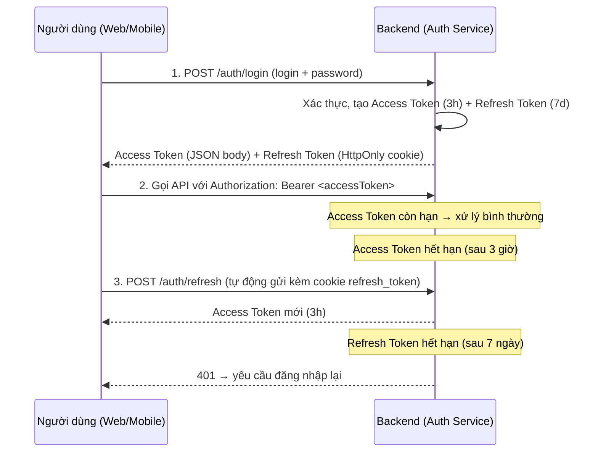

# TÀI LIỆU THIẾT KẾ XÁC THỰC JWT (JWT AUTHENTICATION DESIGN)

## Nền tảng Học tiếng Anh Trực tuyến Đa nền tảng (Web & Mobile App)

**Phiên bản:** 1.0
**Ngày cập nhật:** 22/08/2026
**Liên quan:** `FR-AUTH-02`, `FR-AUTH-05`, `NFR-SEC-03` (BRD/SRS) — `API_Specification.md`

---

## 1. TỔNG QUAN

Hệ thống dùng cơ chế xác thực **stateless** bằng **JWT**, gồm 2 loại token tách biệt:

| Token                  | Vai trò                                     | Nơi lưu                                       | Thời hạn   |
| ---------------------- | ------------------------------------------- | --------------------------------------------- | ---------- |
| **Access Token (JWT)** | Xác thực & phân quyền cho mọi API           | Client gửi qua header `Authorization: Bearer` | **3 giờ**  |
| **Refresh Token**      | Cấp lại Access Token mới khi Access hết hạn | **HttpOnly Secure cookie** `refresh_token`    | **7 ngày** |

---

## 2. THUẬT TOÁN & SECRET KEY

- **Thuật toán:** `HS256` (HMAC-SHA256).
- **Secret key:** lấy từ biến môi trường `JWT_SECRET`.
- **Fallback:** nếu `JWT_SECRET` không được cấu hình, dùng giá trị mặc định được set sẵn trong code (**chỉ dùng cho môi trường dev**).

```yaml
# application.yaml
jwt:
  secret: ${JWT_SECRET:default-secret-key-for-dev-only-change-me}
  access-token-ttl: 10800 # 3 giờ (giây)
  refresh-token-ttl: 604800 # 7 ngày (giây)
```

> ⚠️ **Lưu ý bảo mật:** Môi trường **production bắt buộc** phải set `JWT_SECRET` qua biến môi trường, không dùng giá trị mặc định.

---

## 3. CLAIMS (PAYLOAD CỦA JWT)

Access Token chứa các claim bắt buộc sau:

| Claim             | Ý nghĩa             | Ví dụ                             |
| ----------------- | ------------------- | --------------------------------- |
| `sub` (subject)   | **userId**          | `1002`                            |
| `role`            | Vai trò phân quyền  | `STUDENT` \| `TEACHER` \| `ADMIN` |
| `email`           | Email người dùng    | `student@example.com`             |
| `username`        | Tên tài khoản       | `nguyenvana`                      |
| `iat` (issued at) | Thời điểm phát hành | `1756281600`                      |
| `exp` (expiry)    | Thời điểm hết hạn   | `1756292400` (= iat + 10800)      |

**Ví dụ payload (đã decode):**

```json
{
  "sub": "1002",
  "role": "STUDENT",
  "email": "student@example.com",
  "username": "nguyenvana",
  "iat": 1756281600,
  "exp": 1756292400
}
```

> Backend lấy `userId` từ claim `sub` và `role` từ claim `role` — **không** đọc từ request body/URL.

---

## 4. ACCESS TOKEN

- **Thời hạn:** 3 giờ (10800 giây).
- **Cách gửi:** header `Authorization: Bearer <accessToken>`.
- **Công dụng:** xác thực + phân quyền (RBAC) cho tất cả API được bảo vệ.

---

## 5. REFRESH TOKEN

- **Thời hạn:** 7 ngày (604800 giây).
- **Nơi lưu:** cookie `refresh_token` với thuộc tính:
  - `HttpOnly` — chống JavaScript đọc được (giảm rủi ro XSS).
  - `Secure` — chỉ gửi qua HTTPS.
  - `SameSite=Strict` (hoặc `Lax`) — giảm rủi ro CSRF.
- **Công dụng:** cấp lại Access Token mới khi Access Token hết hạn.

---

## 6. LUỒNG XÁC THỰC (AUTHENTICATION FLOW)



**Chi tiết từng bước:**

1. **Đăng nhập:** User gửi `login` (email hoặc username) + `password` → Backend xác thực → tạo **2 token**:
   - Access Token (3 giờ) trả về trong JSON body.
   - Refresh Token (7 ngày) set vào HttpOnly Secure cookie `refresh_token`.
2. **Sử dụng:** Client gọi mọi API kèm header `Authorization: Bearer <accessToken>`.
3. **Access hết hạn:** Client gọi `POST /auth/refresh` (cookie `refresh_token` tự gửi theo) → Backend cấp Access Token mới.
4. **Refresh hết hạn:** Backend trả `401` → người dùng phải đăng nhập lại.

---

## 7. MÃ LỖI LIÊN QUAN

| HTTP | Mã lỗi nghiệp vụ        | Ý nghĩa                                 |
| ---- | ----------------------- | --------------------------------------- |
| 401  | `UNAUTHORIZED`          | Thiếu/không hợp lệ Authorization header |
| 401  | `TOKEN_EXPIRED`         | Access Token đã hết hạn                 |
| 401  | `INVALID_TOKEN`         | Token sai chữ ký hoặc sai định dạng     |
| 401  | `INVALID_REFRESH_TOKEN` | Refresh Token không hợp lệ              |
| 401  | `REFRESH_TOKEN_EXPIRED` | Refresh Token đã hết hạn (7 ngày)       |
| 403  | `FORBIDDEN`             | Không đủ quyền (role không phù hợp)     |

---

## 8. GHI CHÚ TRIỂN KHAI (BACKEND — OAuth2 Resource Server)

1. **Security dùng OAuth2 Resource Server**: thêm dependency **`spring-boot-starter-oauth2-resource-server`** (đi kèm Spring Security). JWT được **decode/validate tự động** bởi `JwtDecoder` (Nimbus), **không** tự viết filter thủ công.
2. Tạo class `JwtService` (hoặc `JwtTokenProvider`) cho việc **phát hành token**: `generateAccessToken(user)`, `generateRefreshToken(user)`, `parseClaims(token)`.
3. Cấu hình `SecurityFilterChain`:
   ```java
   @Bean
   SecurityFilterChain filterChain(HttpSecurity http) throws Exception {
       return http
           .csrf(csrf -> csrf.disable())
           .cors(Customizer.withDefaults())
           .sessionManagement(sm -> sm.sessionCreationPolicy(SessionCreationPolicy.STATELESS))
           .authorizeHttpRequests(auth -> auth
               .requestMatchers("/api/v1/auth/register", "/api/v1/auth/login",
                                "/api/v1/auth/forgot-password", "/api/v1/auth/reset-password").permitAll()
               .anyRequest().authenticated())
           .oauth2ResourceServer(oauth2 -> oauth2.jwt(Customizer.withDefaults()))
           .build();
   }
   ```
4. **HS256 decoder** (secret từ env, fallback mặc định):
   ```java
   @Bean
   JwtDecoder jwtDecoder(@Value("${jwt.secret}") String secret) {
       SecretKey key = new SecretKeySpec(secret.getBytes(StandardCharsets.UTF_8), "HmacSHA256");
       return NimbusJwtDecoder.withSecretKey(key).macAlgorithm(MacAlgorithm.HS256).build();
   }
   ```
5. Secret key đọc từ `@Value("${jwt.secret}")`; nếu trống thì dùng default (chỉ dev).
6. Refresh Token lưu cookie — cấu hình CORS + `allowCredentials(true)` để cookie hoạt động với Frontend.

---

_Tài liệu định hướng — cập nhật khi Backend có triển khai thực tế._
